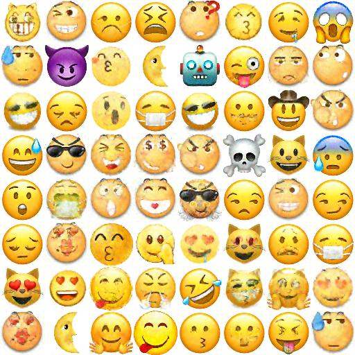
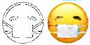
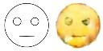
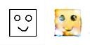

### Emoji  WGANs(improved)  & Pix2Pix

#### Overview

Here are two tensorflow implementation GANs application on Emoji. 

#### Emoji  WGANs(improved) 

Emoji  WGANs(improved) in  the directory named 'emoji_wgan_gp' for learning a mapping from input uniform distribution to output Emoji images , for example:



#### Emoji Pix2Pix

Emoji Pix2Pix in  the directory named 'emoji_pix2pix' for learning a mapping from input sketch image ( black-and-white painting )  to output Emoji images , for example:







#### Dependencies (pip install)

```
cv2
tensorflow
scipy
numpy
```

#### Usage

codes are typed in jupyter notebook which is convenient to debug codes .

Besides the  jupyter notebook , some tool code are included. The  `utils.py` can help you visualize the images in a grid , and the  `canny.py` can help you get the sketch images from original images.

On the training process , the loss information will be saved in the `logs` directory . using tensorboard can see the loss about the Generator and Discriminator.

#### Acknowledgments

Code  refer heavily to [Pokemon_GAN](https://github.com/llSourcell/Pokemon_GAN) , which give me some inspiration to implement the application on Emoji.